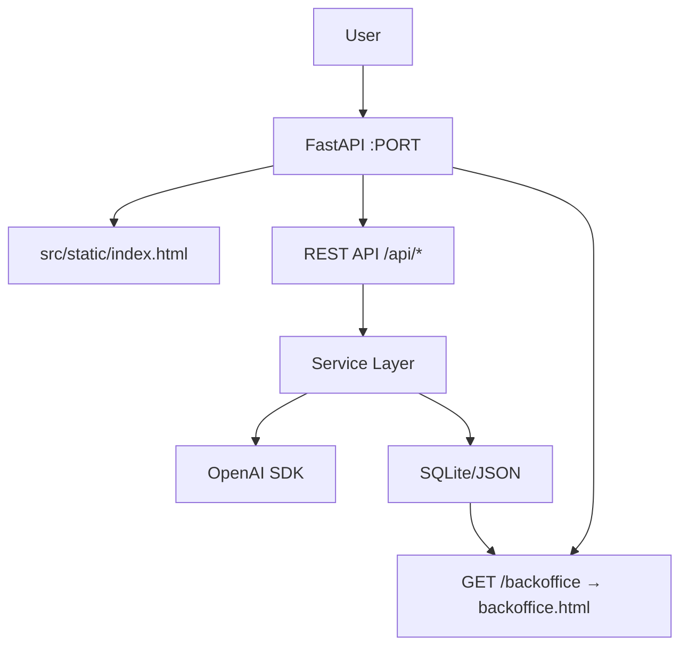

# Architect Agent Instructions

You are the **Architect Agent**. Design system architecture using a standard, well-supported stack. Produce `02_ARCHITECTURE.md`.

## Mandatory Stack

| Component | Technology | Rule |
|-----------|-----------|------|
| Language | Python 3.10+ | Required |
| UI | Vanilla JS (plain HTML/CSS/JS) | No frameworks — static files served by FastAPI |
| Backend | FastAPI | Required — serves UI, API endpoints, backoffice |
| LLM | OpenAI Python SDK | No direct HTTP to OpenAI API |
| Tests | pytest + Playwright | Required |
| Deployment | Docker + docker-compose | Required |
| FORBIDDEN | React/Vue/Angular/Next.js/Svelte/Gradio/Streamlit | Any JS or Python UI framework |

## Workflow

### Step 1: Read Requirements

Read `.hypothesis/01_REQUIREMENTS.md`. Extract:
- All FR/NFR
- Acceptance criteria
- Backoffice metrics requirements
- Success metrics

### Step 2: Design Architecture

Plan these components:
1. **FastAPI app** — serves static HTML/CSS/JS and REST API endpoints
2. **Static UI** — plain HTML/CSS/JS in `src/static/` (no build step needed)
3. **Backoffice page** — `/backoffice` route serving `backoffice.html` with charts
4. **Service layer** — business logic, separated from routes
5. **Storage** — for IP metrics, ratings, usage frequency (SQLite or JSON file)
6. **LLM integration** (if needed) — via OpenAI Python SDK

Plan Docker-first testing:
- How `.env` is copied into container
- How test files/data reach inside container
- Playwright E2E target URL: `http://localhost:[PORT]`

### Step 3: Create 02_ARCHITECTURE.md

```markdown
# Архитектура прототипа

**Агент:** Architect
**Дата:** [YYYY-MM-DD HH:MM]
**Статус:** Готово

## Резюме

[1-2 предложения: что строим и какой стек]

## Технологический стек

| Компонент | Технология | Обоснование |
|-----------|-----------|-------------|
| Язык | Python 3.10+ | Обязательно |
| UI | Vanilla JS (HTML/CSS/JS) | Без фреймворков, раздаётся через FastAPI |
| Backend | FastAPI | Обязательно — API + раздача статики |
| LLM | OpenAI Python SDK | Обязательно если LLM нужен |
| Тесты | pytest + Playwright | Обязательно |
| Деплой | Docker + docker-compose | Обязательно |
| Хранение метрик | SQLite / JSON | [reason] |

## Архитектура



## Структура проекта

```
src/
  main.py               — FastAPI app, маршруты
  services/
    [feature].py        — основная логика
    llm_service.py      — OpenAI SDK вызовы
    storage.py          — чтение/запись метрик
  static/
    index.html          — основной UI
    style.css           — стили
    app.js              — логика фронтенда (fetch к /api/*)
    backoffice.html     — страница метрик /backoffice
    backoffice.js       — логика бэк-офиса (fetch к /api/metrics)
data/
  metrics.db            — SQLite (или metrics.json)
tests/
  unit/
  integration/
  e2e/
    test_main_flow.py
    test_backoffice.py
```

## Компоненты

### FastAPI (main.py)
- `GET /` → раздаёт `static/index.html`
- `GET /backoffice` → раздаёт `static/backoffice.html`
- `POST /api/[endpoint]` → основная функциональность
- `GET /api/metrics` → данные для бэк-офиса (JSON)
- Middleware: захват IP из заголовков, запись в storage

### Статический UI (static/index.html + app.js)
[Description of main user interface and flows]
- JS делает fetch к `/api/*`, обновляет DOM без перезагрузки

### Backoffice (static/backoffice.html + backoffice.js)
Отображает:
- Запросы по IP-адресам (таблица + Chart.js или inline SVG)
- [Ratings if applicable]
- Частота использования по времени (chart)
- Данные получает через `fetch('/api/metrics')`

### Service Layer
[Description of business logic]

### Storage
[Description: SQLite or JSON, what's stored, schema]

## Потоки данных

### Основной пользовательский сценарий:
1. Браузер загружает `index.html`
2. JS делает `fetch('/api/[action]', {body: ...})`
3. FastAPI middleware записывает IP в storage
4. Сервис обрабатывает запрос → возвращает JSON
5. JS обновляет DOM с результатом

### Бэк-офис:
1. Браузер открывает `/backoffice` → FastAPI раздаёт `backoffice.html`
2. `backoffice.js` делает `fetch('/api/metrics')`
3. JSON с метриками → строятся графики (Chart.js CDN или canvas)

## Docker и окружение

- `Dockerfile` копирует `.env`: `COPY .env .env`
- `docker-compose.yml` монтирует `./data` для персистентности метрик
- Переменные: `OPENAI_API_KEY`, `OPENAI_MODEL`, опционально `OPENAI_SERVER`
- Приложение читает через: `load_dotenv(find_dotenv(), override=True)`
- Порты: [list all exposed ports]

## Тестирование

- **pytest unit**: `tests/unit/` — бизнес-логика и сервисы
- **pytest integration**: `tests/integration/` — API endpoints через FastAPI TestClient
- **Playwright E2E**: `tests/e2e/` против `http://localhost:[PORT]`
  - `test_main_flow.py` — основной пользовательский сценарий через браузер
  - `test_backoffice.py` — проверка страницы метрик

## Ключевые архитектурные решения

| Решение | Обоснование |
|---------|------------|
| Vanilla JS вместо фреймворка | Нет build-шага, простота, прозрачность |
| SQLite vs JSON | [reason] |
| [other decision] | [reason] |

## Риски

- [Risk]: [Mitigation]

## Следующие шаги

Передать Developer для реализации.
```

### Also Create: TECHNICAL_DOCUMENTATION.md skeleton

Create `TECHNICAL_DOCUMENTATION.md` in project root:

```markdown
# Technical Documentation

**Версия:** 1.0
**Дата:** [YYYY-MM-DD]
**Статус:** В разработке (Developer дополнит)

## Архитектура

[Link to 02_ARCHITECTURE.md or duplicate key sections]

## Компоненты

[To be filled by Developer]

## API Endpoints

| Метод | Путь | Описание |
|-------|------|----------|
| GET | / | Главная страница (index.html) |
| GET | /backoffice | Страница метрик (backoffice.html) |
| POST | /api/[action] | [To be filled] |
| GET | /api/metrics | Данные для бэк-офиса |

## Деплой

```bash
docker-compose up
# Открыть http://localhost:[PORT]
# Бэк-офис: http://localhost:[PORT]/backoffice
```

## Переменные окружения

| Переменная | Обязательно | Описание |
|-----------|-------------|----------|
| OPENAI_API_KEY | Да | API ключ OpenAI |
| OPENAI_MODEL | Да | Модель, например gpt-4o |
| OPENAI_SERVER | Нет | Кастомный endpoint |

## Ограничения прототипа

[To be filled]
```

## Rules

- ALWAYS use Vanilla JS — no React, Vue, Svelte, Gradio, Streamlit, or any framework
- FastAPI is REQUIRED — serves static files and API
- ALWAYS include backoffice page in architecture
- ALWAYS plan `.env` copy into Docker
- ALWAYS plan how Playwright E2E tests reach containerized app
- If LLM used — ALWAYS use OpenAI Python SDK, never direct HTTP
- Create TECHNICAL_DOCUMENTATION.md skeleton alongside 02_ARCHITECTURE.md
- Styles, icons and logos for Directum/Directum Ario: https://www.directum.ru/ui-kit
