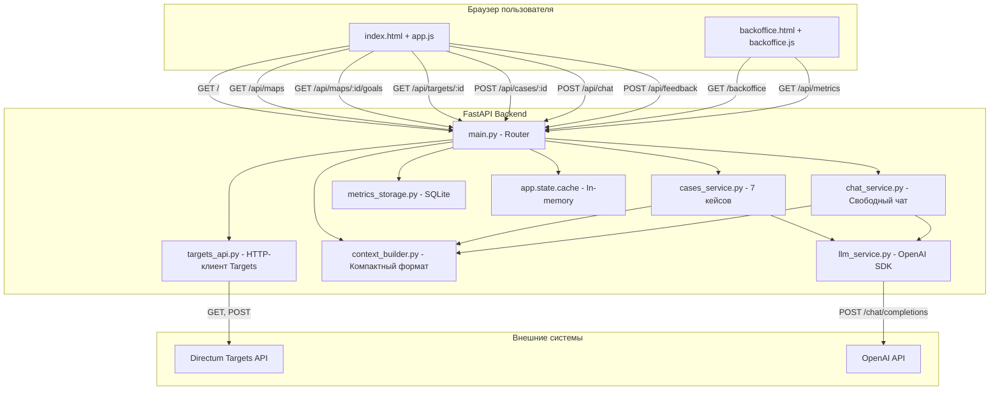
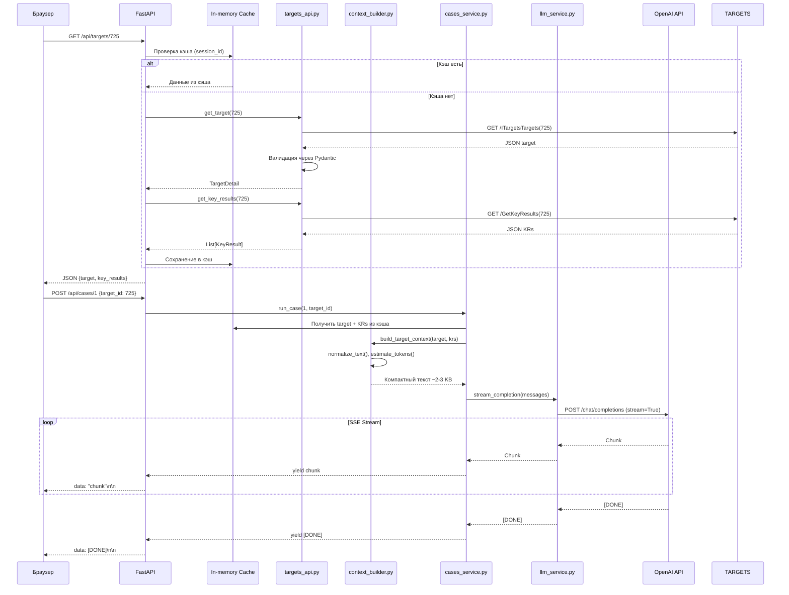

# Архитектура прототипа v2

**Агент:** Architect
**Дата:** 2026-02-19
**Статус:** Готово
**Версия:** 2.0

---

## Резюме изменений v1 → v2

**Удалено из v1:**
- Загрузка файлов через UI (`/api/upload`, `<input type="file">`)
- Парсеры `json_parser.py`, `docx_parser.py`
- Поле `docx_content` в API-запросах

**Добавлено в v2:**
- Прямая интеграция с Directum Targets API (4 endpoint'а)
- Левая панель навигации: фильтр периода → список карт → список целей
- Адаптивные кейсы (режим «Карта» vs режим «Цель»)
- Кнопка «Новая беседа» — сброс истории диалога с сохранением выбранного контекста
- Session-based кэширование API-ответов (in-memory)
- Компактный текстовый формат для LLM (вместо сырого JSON)
- Нормализация текстовых полей (удаление escape-последовательностей `\n`, `\\`, `\r`)
- Оценка размера контекста через `tiktoken` с предупреждениями при превышении лимита
- Переменные окружения `TARGETS_BASE_URL`, `TARGETS_TOKEN`

**Сохранено из v1:**
- 7 кейсов OKR-анализа (логика промптов переиспользуется, формат контекста адаптируется)
- SSE стриминг ответов (`stream_completion`, `readSSEStreamToElement`, `AbortController`)
- Бэк-офис с метриками (`/backoffice`, SQLite, `metrics_storage.py`)
- Система оценок 👍/👎
- FastAPI + Vanilla JS архитектура
- Docker + docker-compose деплой
- Построчный `renderMarkdown` без зависимостей

---

## Технологический стек

| Компонент | Технология | Обоснование |
|-----------|------------|-------------|
| **Backend** | FastAPI 0.115+ | Обязателен по требованиям системы; встроенная поддержка SSE через `StreamingResponse` |
| **Frontend** | Vanilla JS (HTML/CSS/JS) | Обязателен по требованиям; никаких фреймворков (React/Vue/Angular запрещены) |
| **LLM API** | OpenAI Python SDK (`AsyncOpenAI`) | Единственный разрешенный SDK для LLM-запросов; переиспользуется `llm_service.py` |
| **HTTP-клиент** | `httpx` (async) | Асинхронный HTTP-клиент для запросов к Targets API |
| **Валидация** | `pydantic` v2 | Валидация структур данных из Targets API |
| **Токенизация** | `tiktoken` | Оценка размера контекста перед передачей в модель |
| **БД метрик** | SQLite | Легковесное хранилище для метрик бэк-офиса (переиспользуется `metrics_storage.py`) |
| **Тесты: Unit** | `pytest` ≥8.0, `pytest-asyncio`, `pytest-cov` | Асинхронные тесты, покрытие ≥70% |
| **Тесты: E2E** | Playwright | E2E-тесты запускаются **снаружи контейнера** против `localhost:8000` |
| **Деплой** | Docker + docker-compose | Обязателен; multi-stage Dockerfile (production без Playwright) |
| **Стили** | Directum UI Kit | https://www.directum.ru/ui-kit — цвета, шрифты, иконки |

---

## Архитектура системы

### Схема компонентов



### Поток данных для кейса



---

## Структура проекта

```
Proto8.Targets/
├── .hypothesis/
│   ├── v2_01_REQUIREMENTS.md     ← BA output
│   └── v2_02_ARCHITECTURE.md     ← этот файл
├── new_hypothesis/
│   ├── 001_HYPOTHESIS.md         ← исходная гипотеза
│   ├── maps.json                 ← пример API ответа
│   ├── map.json                  ← пример графа целей
│   ├── target.json               ← пример расширенной цели
│   └── key_result.json           ← пример КР
├── src/
│   ├── main.py                   ← FastAPI app, роутеры
│   ├── config.py                 ← Загрузка .env (TARGETS_BASE_URL, TARGETS_TOKEN, OPENAI_*)
│   ├── models/
│   │   ├── targets.py            ← Pydantic модели для Targets API
│   │   └── api.py                ← Pydantic схемы FastAPI endpoints
│   ├── services/
│   │   ├── targets_api.py        ← NEW: HTTP-клиент для Targets API
│   │   ├── context_builder.py    ← NEW: Компактный формат для LLM
│   │   ├── cases_service.py      ← MODIFIED: адаптирован под новый контекст
│   │   ├── chat_service.py       ← MODIFIED: адаптирован под новый контекст
│   │   ├── llm_service.py        ← REUSED: stream_completion as-is
│   │   └── metrics_storage.py    ← REUSED: SQLite метрики as-is
│   └── static/
│       ├── index.html            ← MODIFIED: левая панель + адаптивные кейсы
│       ├── app.js                ← MODIFIED: навигация, кэш сессии, фильтр периода
│       ├── style.css             ← EXTENDED: двухколоночный layout
│       ├── backoffice.html       ← REUSED: страница метрик
│       └── backoffice.js         ← REUSED: Charts.js (локальная копия!)
├── tests/
│   ├── unit/
│   │   ├── test_targets_api.py   ← NEW: моки httpx
│   │   ├── test_context_builder.py ← NEW: тесты форматирования
│   │   ├── test_cases_service.py ← MODIFIED: адаптировать под новый формат
│   │   └── test_metrics.py       ← REUSED
│   └── e2e/
│       └── test_ui_flow.py       ← MODIFIED: новая навигация
├── Dockerfile                    ← MODIFIED: multi-stage (production / test)
├── docker-compose.yml            ← MODIFIED: env_file + volumes
├── requirements.txt              ← ADD: httpx, tiktoken
├── pytest.ini
├── .coveragerc
├── .env.example                  ← ADD: TARGETS_BASE_URL, TARGETS_TOKEN
└── README.md
```

---

## Новые компоненты

### 1. `src/services/targets_api.py`

**Назначение:** Асинхронный HTTP-клиент для Directum Targets API.

**Основные функции:**

```python
async def get_maps() -> List[TargetsMap]:
    """
    Загружает список карт целей.
    GET {TARGETS_BASE_URL}/Integration/odata/ITargetsTargetsMaps
    Authorization: Bearer {TARGETS_TOKEN}

    Возвращает: List[TargetsMap] с полями Id, Name, Code, PeriodLabel,
                AchievementPercentage, Status
    Фильтрует: только поля из FR-02 (удаляет @odata.context, служебные)
    """

async def get_map_graph(map_id: int) -> MapGraph:
    """
    Загружает граф целей карты.
    POST {TARGETS_BASE_URL}/integration/odata/Targets/GetGoalsMap
    Body: {"mapId": map_id}

    Возвращает: MapGraph с полями Nodes (список GoalNode), Map
    Каждый GoalNode содержит: TargetId, Code, Name, ParentId, ChildIds,
                               Priority, Progress, KeyResultCount,
                               Status, Responsible, StructuralUnit, Period,
                               LastAchievementStatus
    """

async def get_target(target_id: int) -> TargetDetail:
    """
    Загружает расширенную информацию по цели.
    GET {TARGETS_BASE_URL}/Integration/odata/ITargetsTargets({target_id})

    Возвращает: TargetDetail с полями Id, Name, Code, StatusDescription,
                PeriodLabel, AchievementPercentage, PeriodStart, PeriodEnd,
                IsPersonal, Description, Notes, Priority
    """

async def get_key_results(target_id: int) -> List[KeyResult]:
    """
    Загружает ключевые результаты цели.
    GET {TARGETS_BASE_URL}/integration/odata/Targets/GetKeyResults(targetId={target_id})

    Возвращает: List[KeyResult] с полями Description, AchievementPercentage,
                Metric, InitialValue, PlannedValue, ActualValue
    """
```

**Обработка ошибок:**

- `401 Unauthorized` → raise `HTTPException(401, "Bearer-токен истёк. Обновите TARGETS_TOKEN в .env и перезапустите")
- `403 Forbidden` → raise `HTTPException(403, "Доступ запрещён. Проверьте права токена")
- `404 Not Found` → raise `HTTPException(404, "Карта/цель не найдена")
- `500 Server Error` → raise `HTTPException(500, "Ошибка API Targets: ...")
- `Timeout` → raise `HTTPException(504, "Таймаут API Targets. Повторите запрос")

**Pydantic модели:** Все ответы валидируются через модели из `src/models/targets.py`.

---

### 2. `src/services/context_builder.py`

**Назначение:** Преобразование JSON из Targets API в компактный текстовый формат для передачи в LLM.

**Основные функции:**

```python
def build_map_context(nodes: List[GoalNode], map_info: TargetsMap) -> str:
    """
    Формирует компактный текстовый контекст карты целей.

    Формат (FR-16):
    Карта целей: {Name} | Период: {PeriodLabel} | Прогресс: {AchievementPercentage}%

    [{Code}] {Name}
      Ответственный: {Responsible.Name} | Подразделение: {StructuralUnit.Name}
      Период: {Period.Name} | Приоритет: {Priority} | Прогресс: {Progress}% | КР: {KeyResultCount}
      Статус: {Status.Name} {Status.Icon}
      Дочерние: {ChildIds -> Code, Name через запятую}
      Отчёт ({ReportDate}): {LastAchievementStatus.Description}
    ---

    Для каждой цели — 6-8 строк.
    Применяет normalize_text() к Description, Notes, LastAchievementStatus.
    """

def build_target_context(target: TargetDetail, key_results: List[KeyResult]) -> str:
    """
    Формирует компактный текстовый контекст цели.

    Формат (FR-17):
    Цель: [{Code}] {Name}
    Период: {PeriodLabel} ({PeriodStart} — {PeriodEnd})
    Статус: {StatusDescription} | Прогресс: {AchievementPercentage}% | Приоритет: {Priority}

    Описание:
    {Description}

    Заметки руководства:
    {Notes}

    Ключевые результаты:
    - {Description}: {AchievementPercentage}%
      (Метрика: {Metric} | Нач: {InitialValue} | План: {PlannedValue} | Факт: {ActualValue})

    Применяет normalize_text() к Description, Notes.
    """

def normalize_text(text: str) -> str:
    """
    Удаляет escape-последовательности из текстовых полей.

    Замены:
    - \\n → \n (реальный перенос)
    - \\\\ → \ (одинарный слеш)
    - \\r → (удалить)
    - Другие артефакты экранирования по необходимости

    Используется для Description, Notes, LastAchievementStatus.Description.
    """

def estimate_tokens(text: str, model: str = "gpt-4o") -> int:
    """
    Оценивает количество токенов в тексте через tiktoken.

    Используется для проверки размера контекста перед передачей в модель.
    Если токенов > CONTEXT_LIMIT (например 100k для gpt-4o),
    возвращает предупреждение пользователю.
    """
```

**Пример вывода `build_map_context` (фрагмент):**

```
Карта целей: Цели на 2026. Разработка Ario | Период: 2026 | Прогресс: 31.0%

[U-26.4.1] Запустить ИИ-помощника в промышленную эксплуатацию у клиентов
  Ответственный: Беляк Игорь Сергеевич | Подразделение: БЕ Ario
  Период: 2026 год | Приоритет: Medium | Прогресс: 5.63% | КР: 4
  Статус: В работе: Есть угроза недостижения Yellow
  Дочерние: U-1Q26.1-2, U-4Q25.1.4, U-4Q25.1.5
  Отчёт (2026-01-15): На данный момент из фич ИИ-помощника для клиентов доступны только свободное общение и Сервисы компании (ESM).
Первая фича достаточно простая и большой ценности не несет...
---

[U-26.4.2] Усилить роль Центра компетенций по ИИ как драйвера встраивания ИИ в продукты и процессы
  Ответственный: Беляк Игорь Сергеевич | Подразделение: БЕ Ario
  Период: 2026 год | Приоритет: Medium | Прогресс: 12.54% | КР: 5
  Статус: В работе: Идет по плану Green
  Дочерние: —
  Отчёт (2026-01-15): Результат 1: DAU (активных пользователей в день) в рамках эксперимента по разработке 30...
---
```

**Оценка размера:**
- Карта из 20 целей → ~15-20 KB текста → ~4-5k токенов
- Карта из 100 целей → ~80-100 KB текста → ~20-25k токенов
- Карта из 300 целей → ~250 KB текста → ~60-70k токенов (близко к лимиту gpt-4o 128k)

---

### 3. Session Cache (In-memory)

**Назначение:** Кэширование данных API на время сессии пользователя.

**Реализация:** Словарь в `app.state.cache` (FastAPI):

```python
# В main.py при инициализации
app.state.cache = {}

# Структура кэша:
{
  "session_id": {
    "maps": List[TargetsMap],           # Список карт (на всю сессию)
    "map_graph": {
      map_id: MapGraph                   # Граф целей карты
    },
    "targets": {
      target_id: {
        "detail": TargetDetail,          # Расширенная информация
        "key_results": List[KeyResult]   # КР
      }
    }
  }
}
```

**Логика кэширования:**

- **Список карт:** Загружается при первом обращении к `/api/maps`, кэшируется на всю сессию
- **Граф карты:** Загружается при выборе карты в UI (`/api/maps/{map_id}/goals`), кэшируется до смены карты
- **Цель + КР:** Загружаются при выборе цели в UI (`/api/targets/{target_id}`), кэшируются до смены цели

**Session ID:** Генерируется на фронте через `sessionStorage`, передаётся в заголовке `X-Session-Id`.

**Инвалидация:** При перезапуске приложения (in-memory словарь очищается). Для production можно добавить TTL или Redis, но для прототипа in-memory достаточен.

---

## API Endpoints

### GET `/`

**Описание:** Главная страница приложения.

**Ответ:** `index.html`

---

### GET `/backoffice`

**Описание:** Страница метрик бэк-офиса.

**Ответ:** `backoffice.html`

---

### GET `/api/maps`

**Описание:** Возвращает список карт целей с фильтрацией по периоду (опционально).

**Query params:**
- `period` (опционально) — значение `PeriodLabel` для фильтрации

**Логика:**
1. Проверить кэш по `session_id`
2. Если кэша нет → вызвать `targets_api.get_maps()`, сохранить в кэш
3. Если `period` указан → фильтровать по `PeriodLabel == period`
4. Вернуть список карт с полями: `Id, Name, Code, PeriodLabel, AchievementPercentage, Status`

**Ответ:**
```json
{
  "maps": [
    {
      "id": 15,
      "name": "Цели на 2026. Разработка Ario",
      "code": "U-26.4",
      "period_label": "2026",
      "achievement_percentage": 31.0,
      "status": "Active"
    }
  ],
  "periods": ["2026", "1 квартал 2026", "4 квартал 2025"]
}
```

---

### GET `/api/maps/{map_id}/goals`

**Описание:** Возвращает граф целей карты (список узлов).

**Path params:**
- `map_id` — ID карты

**Логика:**
1. Проверить кэш по `session_id` → `map_graph[map_id]`
2. Если кэша нет → вызвать `targets_api.get_map_graph(map_id)`, сохранить в кэш
3. Вернуть список узлов

**Ответ:**
```json
{
  "map": {
    "id": 15,
    "name": "Цели на 2026. Разработка Ario",
    "progress": 31.0
  },
  "nodes": [
    {
      "target_id": 36,
      "code": "U-26.4.1",
      "name": "Запустить ИИ-помощника в промышленную эксплуатацию у клиентов",
      "progress": 5.63,
      "status_name": "В работе: Есть угроза недостижения",
      "status_icon": "Yellow",
      "priority": "Medium",
      "responsible_name": "Беляк Игорь Сергеевич",
      "period_name": "2026 год",
      "key_result_count": 4
    }
  ]
}
```

---

### GET `/api/targets/{target_id}`

**Описание:** Возвращает расширенную информацию по цели + ключевые результаты.

**Path params:**
- `target_id` — ID цели

**Логика:**
1. Проверить кэш по `session_id` → `targets[target_id]`
2. Если кэша нет:
   - Вызвать `targets_api.get_target(target_id)`
   - Вызвать `targets_api.get_key_results(target_id)`
   - Сохранить в кэш
3. Вернуть данные

**Ответ:**
```json
{
  "target": {
    "id": 97,
    "name": "Усилить роль Центра компетенций по ИИ...",
    "code": "U-26.4.2",
    "status_description": "В работе: Идет по плану",
    "period_label": "2026",
    "achievement_percentage": 12.54,
    "period_start": "2025-10-01T00:00:00+04:00",
    "period_end": "2026-09-30T00:00:00+04:00",
    "is_personal": false,
    "description": "В рамках этой цели выделяются три ключевых направления...",
    "notes": null,
    "priority": "Medium"
  },
  "key_results": [
    {
      "description": "Выделена и функционирует должность CPO",
      "achievement_percentage": "100",
      "metric": null,
      "initial_value": null,
      "planned_value": null,
      "actual_value": null
    }
  ]
}
```

---

### POST `/api/cases/{case_id}`

**Описание:** Запускает один из 7 кейсов OKR-анализа с потоковым ответом (SSE).

**Path params:**
- `case_id` — 1-7

**Body:**
```json
{
  "mode": "map" | "target",
  "map_id": 15,              // Обязателен для режима "map"
  "target_id": 97,           // Обязателен для режима "target"
  "session_id": "sess_..."   // Session ID для доступа к кэшу
}
```

**Логика:**
1. Определить режим (map/target)
2. Загрузить данные из кэша:
   - Для режима "map": `map_graph[map_id]`
   - Для режима "target": `targets[target_id]` (detail + key_results)
3. Вызвать `context_builder.build_map_context()` или `build_target_context()`
4. Проверить размер контекста через `estimate_tokens()`:
   - Если > 100k токенов → вернуть предупреждение в SSE-потоке
5. Вызвать `cases_service.run_case(case_id, context, mode)`
6. Стримить ответ через SSE

**Ответ:** SSE stream (как в v1)

**Адаптация кейсов:**

| Кейс | Режим | Промпт адаптирован |
|------|-------|---------------------|
| 1. Формулировка цели | target | Передаётся `build_target_context` + промпт как в v1 |
| 2. Ключевые результаты | target | Передаётся `build_target_context` + промпт как в v1 |
| 3. Квартальная декомпозиция | target | Передаётся `build_target_context` + промпт как в v1 |
| 4. Верификация по замечаниям | target | Передаётся `build_target_context` (поле Notes) + промпт как в v1 |
| 5. Конфликты и слепые зоны | map | Передаётся `build_map_context` + промпт как в v1 |
| 6. Риски достижения | target | Передаётся `build_target_context` + промпт как в v1 |
| 7. Экспресс-отчёт | map | Передаётся `build_map_context` + промпт как в v1 |

---

### POST `/api/chat`

**Описание:** Свободный чат с ИИ-помощником (SSE).

**Body:**
```json
{
  "mode": "map" | "target",
  "map_id": 15,
  "target_id": 97,
  "session_id": "sess_...",
  "messages": [
    {"role": "user", "content": "..."},
    {"role": "assistant", "content": "..."}
  ]
}
```

**Логика:**
1. Загрузить контекст из кэша (как в `/api/cases`)
2. Построить системный промпт + контекст
3. Добавить историю `messages`
4. Вызвать `llm_service.stream_completion(messages)`
5. Стримить ответ через SSE

**Ответ:** SSE stream

---

### POST `/api/feedback`

**Описание:** Сохраняет оценку пользователя (👍/👎).

**Body:**
```json
{
  "case_id": 1,
  "session_id": "sess_...",
  "vote": 1  // 1 = 👍, -1 = 👎
}
```

**Ответ:**
```json
{"success": true}
```

---

### GET `/api/metrics`

**Описание:** Возвращает агрегированные метрики для бэк-офиса.

**Ответ:** (переиспользуется из v1)

```json
{
  "total_requests": 156,
  "unique_ips": 12,
  "ip_stats": [{"ip": "192.168.1.5", "count": 42}],
  "case_stats": [
    {
      "case_id": 1,
      "requests": 15,
      "positive": 12,
      "negative": 2,
      "pct_positive": 85.7
    }
  ],
  "timeline": [{"date": "2026-02-15", "count": 18}],
  "total_positive_pct": 78.5,
  "top_maps": [
    {"map_id": 15, "name": "Цели на 2026. Разработка Ario", "count": 45}
  ],
  "top_targets": [
    {"target_id": 97, "code": "U-26.4.2", "name": "Усилить роль ЦК по ИИ", "count": 28}
  ]
}
```

**Дополнительно для v2:**

- `top_maps` — топ-5 карт по количеству обращений (JOIN с таблицей `requests` по `map_id`)
- `top_targets` — топ-5 целей по количеству обращений (JOIN по `target_id`)

**Схема БД:** Добавить поля `map_id`, `target_id` в таблицу `requests`.

---

## UI Layout (index.html)

### Общая структура

```
┌─────────────────────────────────────────────────────────┐
│ Header: Directum Targets AI Assistant | /backoffice    │
├──────────────┬──────────────────────────────────────────┤
│              │                                          │
│  Левая       │  Основная область                        │
│  панель      │                                          │
│  (280px)     │  [Tabs: 7 кейсов | Свободный чат]       │
│              │  [Кнопки кейсов 1-7 или 5,7]             │
│              │  [Область вывода результата]             │
│              │  [Чат: история + input + "Новая беседа"] │
│              │                                          │
│  [Фильтр]    │                                          │
│  [Карты]     │                                          │
│  [Цели]      │                                          │
│              │                                          │
└──────────────┴──────────────────────────────────────────┘
```

### Левая панель

```html
<aside class="sidebar">
  <!-- Фильтр периода -->
  <div class="sidebar-section">
    <label>Период:</label>
    <select id="period-filter" onchange="filterMapsByPeriod()">
      <option value="">— все периоды —</option>
      <option value="2026">2026</option>
      <option value="1 квартал 2026">1 квартал 2026</option>
    </select>
  </div>

  <!-- Список карт -->
  <div class="sidebar-section">
    <h3>Карты целей</h3>
    <div id="maps-list" class="maps-list">
      <!-- Динамически заполняется через app.js -->
      <div class="map-item" data-map-id="15" onclick="selectMap(15)">
        <div class="map-name">Цели на 2026. Разработка Ario</div>
        <div class="map-meta">31.0% • Active</div>
      </div>
    </div>
  </div>

  <!-- Список целей (показывается после выбора карты) -->
  <div id="goals-section" class="sidebar-section hidden">
    <h3>Цели карты</h3>
    <div id="goals-list" class="goals-list">
      <!-- Динамически заполняется -->
      <div class="goal-item" data-target-id="97" onclick="selectGoal(97)">
        <div class="goal-code">U-26.4.2</div>
        <div class="goal-name">Усилить роль ЦК по ИИ...</div>
        <div class="goal-meta">12.5% • Green</div>
      </div>
    </div>
  </div>
</aside>
```

**Логика:**

1. При загрузке страницы: `loadMaps()` → GET `/api/maps` → заполнить список карт
2. При смене фильтра периода: перезагрузить список карт с query-параметром `?period=2026`
3. При клике на карту: `selectMap(map_id)` → GET `/api/maps/{map_id}/goals` → заполнить список целей, показать секцию целей
4. При клике на цель: `selectGoal(target_id)` → GET `/api/targets/{target_id}` → сохранить в `state.selectedTarget`, подсветить выбранную цель

**Состояние UI:**
- Выбранная карта → подсветка `.map-item.active`
- Выбранная цель → подсветка `.goal-item.active`
- Если карта выбрана, но цель нет → **режим «Карта»** (доступны кейсы 5, 7)
- Если цель выбрана → **режим «Цель»** (доступны кейсы 1, 2, 3, 4, 6)

---

### Основная область

```html
<main class="main-area">
  <!-- Вкладки -->
  <div class="tabs">
    <button class="tab-btn active" onclick="switchTab('cases', this)">7 кейсов</button>
    <button class="tab-btn" onclick="switchTab('chat', this)">Свободный чат</button>
  </div>

  <!-- Контент вкладки "7 кейсов" -->
  <div id="tab-cases" class="tab-content active">
    <!-- Адаптивные кнопки кейсов -->
    <div id="cases-grid" class="cases-grid">
      <!-- Кейсы 1-4, 6 показываются только если target выбран -->
      <div class="case-card" data-case-id="1" data-mode="target">
        <div class="case-number">Кейс 1</div>
        <div class="case-title">Сформулировать описание цели</div>
        <div class="case-desc">Проверка SMART, амбициозность, генерация вариантов</div>
        <button onclick="runCase(1)">Запустить</button>
      </div>

      <!-- Кейсы 5, 7 показываются если map выбрана -->
      <div class="case-card" data-case-id="5" data-mode="map">
        <div class="case-number">Кейс 5</div>
        <div class="case-title">Найти конфликты и слепые зоны</div>
        <div class="case-desc">Анализ стратегии по всей карте</div>
        <button onclick="runCase(5)">Запустить</button>
      </div>
    </div>

    <!-- Область вывода результата -->
    <div id="result-area" class="result-area hidden">
      <div class="result-header">
        <span id="result-case-label"></span>
        <span id="result-loading" class="spinner hidden"></span>
      </div>
      <div id="result-content" class="result-content"></div>

      <!-- Оценка -->
      <div id="feedback-bar" class="feedback-bar hidden">
        <span>Оцените результат:</span>
        <button id="btn-thumbs-up" onclick="sendFeedback(1)">👍</button>
        <button id="btn-thumbs-down" onclick="sendFeedback(-1)">👎</button>
        <span id="feedback-sent" class="hidden">Спасибо!</span>
      </div>
    </div>
  </div>

  <!-- Контент вкладки "Свободный чат" -->
  <div id="tab-chat" class="tab-content">
    <div class="chat-container">
      <div id="chat-messages" class="chat-messages">
        <div class="chat-message assistant">
          Здравствуйте! Я помогу вам работать с целями из Directum Targets.
          Выберите карту или конкретную цель слева, затем задайте вопрос.
        </div>
      </div>
      <div class="chat-input-area">
        <textarea id="chat-input" placeholder="Задайте вопрос..."></textarea>
        <button id="btn-chat-send" onclick="sendChatMessage()">Отправить</button>
        <button id="btn-new-conversation" onclick="resetConversation()">Новая беседа</button>
      </div>
    </div>
  </div>
</main>
```

**Логика адаптивных кейсов:**

```js
function updateCasesVisibility() {
  const hasTarget = state.selectedTarget !== null;
  const hasMap = state.selectedMap !== null;

  document.querySelectorAll('.case-card').forEach(card => {
    const mode = card.dataset.mode; // "map" or "target"
    if (mode === 'target' && !hasTarget) {
      card.classList.add('disabled');
    } else if (mode === 'map' && !hasMap) {
      card.classList.add('disabled');
    } else {
      card.classList.remove('disabled');
    }
  });
}
```

**Кнопка "Новая беседа":**

```js
function resetConversation() {
  state.chatMessages = [];
  sessionStorage.removeItem('targets_chat');
  document.getElementById('chat-messages').innerHTML = `
    <div class="chat-message assistant">
      Здравствуйте! Я помогу вам работать с целями из Directum Targets.
      Выберите карту или конкретную цель слева, затем задайте вопрос.
    </div>
  `;
  // Выбранная карта/цель остаются!
}
```

---

## Обработка ошибок API

### 401 Unauthorized

**Причина:** Bearer-токен истёк или невалиден.

**Обработка:**

```python
# В targets_api.py
except httpx.HTTPStatusError as e:
    if e.response.status_code == 401:
        raise HTTPException(
            status_code=401,
            detail="Bearer-токен истёк. Обновите TARGETS_TOKEN в .env и перезапустите приложение."
        )
```

**UI:** Показать красный алерт с сообщением об ошибке.

---

### 403 Forbidden

**Причина:** Токен не имеет прав доступа к ресурсу.

**Обработка:**

```python
if e.response.status_code == 403:
    raise HTTPException(
        status_code=403,
        detail="Доступ запрещён. Проверьте права токена в системе Targets."
    )
```

---

### 500 Server Error

**Причина:** Внутренняя ошибка API Targets.

**Обработка:**

```python
if e.response.status_code >= 500:
    raise HTTPException(
        status_code=500,
        detail=f"Ошибка API Targets: {e.response.text}"
    )
```

---

### Timeout

**Причина:** API Targets не отвечает.

**Обработка:**

```python
# В httpx.AsyncClient
timeout = httpx.Timeout(30.0)  # 30 сек

except httpx.TimeoutException:
    raise HTTPException(
        status_code=504,
        detail="Таймаут API Targets. Повторите запрос позже."
    )
```

---

### Превышение лимита контекста

**Причина:** Карта целей слишком большая (>100k токенов).

**Обработка:**

```python
# В context_builder.py
if estimate_tokens(context) > 100000:
    return {
        "warning": "Карта целей очень большая (>100k токенов). "
                   "Рекомендуется выбрать конкретную цель для анализа. "
                   "Продолжить? (некоторые данные могут быть обрезаны)"
    }
```

**UI:** Показать жёлтый алерт с предупреждением, дать кнопку "Продолжить" или "Выбрать цель".

---

## Тестирование

### Unit-тесты (pytest)

**Новые тесты:**

1. **`tests/unit/test_targets_api.py`** — тестирование HTTP-клиента с моками `httpx`:
   ```python
   @pytest.mark.asyncio
   async def test_get_maps_success(httpx_mock):
       httpx_mock.add_response(json={"value": [{"Id": 15, "Name": "Test"}]})
       maps = await get_maps()
       assert len(maps) == 1
       assert maps[0].id == 15

   @pytest.mark.asyncio
   async def test_get_maps_401(httpx_mock):
       httpx_mock.add_response(status_code=401)
       with pytest.raises(HTTPException) as exc_info:
           await get_maps()
       assert exc_info.value.status_code == 401
       assert "токен истёк" in exc_info.value.detail.lower()
   ```

2. **`tests/unit/test_context_builder.py`** — тестирование форматирования:
   ```python
   def test_normalize_text():
       input_text = "Текст с \\n переносами \\r и \\\\ слешами"
       expected = "Текст с \n переносами  и \\ слешами"
       assert normalize_text(input_text) == expected

   def test_build_target_context():
       target = TargetDetail(id=97, name="Test", ...)
       key_results = [KeyResult(description="KR1", ...)]
       context = build_target_context(target, key_results)
       assert "Цель: [" in context
       assert "Ключевые результаты:" in context
       assert "KR1" in context

   def test_estimate_tokens():
       text = "Короткий текст"
       tokens = estimate_tokens(text)
       assert tokens > 0
       assert tokens < 10
   ```

3. **`tests/unit/test_cases_service.py`** — адаптация под новый формат контекста:
   ```python
   @pytest.mark.asyncio
   async def test_case1_target_mode(mocker):
       mock_llm = mocker.patch('src.services.llm_service.stream_completion')
       mock_llm.return_value = async_generator(["chunk1", "chunk2"])

       context = "Цель: [U-26.4.2] Test..."
       generator = await run_case(1, mode="target", context=context)
       chunks = [chunk async for chunk in generator]

       assert len(chunks) == 2
       mock_llm.assert_called_once()
       messages = mock_llm.call_args[0][0]
       assert any("SMART" in str(m) for m in messages)
   ```

**Существующие тесты (переиспользуются):**

- `test_llm_service.py` — as-is (stream_completion не меняется)
- `test_metrics.py` — as-is + добавить тесты для `top_maps`, `top_targets`

**Coverage:** ≥70% по всем модулям.

---

### E2E-тесты (Playwright)

**Файл:** `tests/e2e/test_ui_flow.py`

**Сценарии:**

1. **Загрузка главной страницы:**
   ```python
   def test_index_page_loads(page):
       page.goto("http://localhost:8000/")
       assert page.title() == "Directum Targets AI Assistant"
       assert page.locator(".sidebar").is_visible()
   ```

2. **Фильтрация карт по периоду:**
   ```python
   def test_filter_maps_by_period(page):
       page.goto("http://localhost:8000/")
       page.select_option("#period-filter", "2026")
       page.wait_for_timeout(1000)  # Ждём загрузки
       maps = page.locator(".map-item").all()
       assert len(maps) > 0
       # Проверяем, что все карты содержат "2026" в метаданных
   ```

3. **Выбор карты → загрузка целей:**
   ```python
   def test_select_map_loads_goals(page):
       page.goto("http://localhost:8000/")
       page.click(".map-item[data-map-id='15']")
       page.wait_for_selector(".goal-item")
       goals = page.locator(".goal-item").all()
       assert len(goals) > 0
   ```

4. **Выбор цели → адаптивные кейсы:**
   ```python
   def test_select_goal_shows_target_cases(page):
       page.goto("http://localhost:8000/")
       page.click(".map-item[data-map-id='15']")
       page.click(".goal-item[data-target-id='97']")
       page.wait_for_timeout(500)

       # Кейсы 1-4, 6 доступны
       assert not page.locator(".case-card[data-case-id='1']").get_attribute("class").includes("disabled")
       # Кейс 5 недоступен (для карты)
       assert page.locator(".case-card[data-case-id='5']").get_attribute("class").includes("disabled")
   ```

5. **Запуск кейса → SSE стриминг:**
   ```python
   def test_run_case_streams_result(page):
       page.goto("http://localhost:8000/")
       page.click(".map-item[data-map-id='15']")
       page.click(".goal-item[data-target-id='97']")
       page.click(".case-card[data-case-id='1'] button")

       page.wait_for_selector("#result-area:not(.hidden)")
       page.wait_for_selector("#result-content", state="visible")
       page.wait_for_timeout(2000)  # Даём время на стриминг

       content = page.locator("#result-content").text_content()
       assert len(content) > 100  # Проверяем что есть контент
   ```

6. **Оценка результата:**
   ```python
   def test_feedback_thumbs_up(page):
       # ... запуск кейса ...
       page.wait_for_selector("#feedback-bar:not(.hidden)")
       page.click("#btn-thumbs-up")
       page.wait_for_selector("#feedback-sent:not(.hidden)")
       assert page.locator("#btn-thumbs-up").get_attribute("class").includes("active-pos")
   ```

7. **Свободный чат:**
   ```python
   def test_chat_sends_message(page):
       page.goto("http://localhost:8000/")
       page.click(".map-item[data-map-id='15']")
       page.click(".tab-btn:has-text('Свободный чат')")
       page.fill("#chat-input", "Какие цели в карте?")
       page.click("#btn-chat-send")

       page.wait_for_selector(".chat-message.user")
       page.wait_for_selector(".chat-message.assistant", state="visible")
       page.wait_for_timeout(2000)

       messages = page.locator(".chat-message.assistant").all()
       assert len(messages) >= 2  # Приветствие + ответ
   ```

8. **Кнопка "Новая беседа":**
   ```python
   def test_reset_conversation(page):
       # ... отправить сообщение ...
       page.click("#btn-new-conversation")
       messages = page.locator(".chat-message").all()
       assert len(messages) == 1  # Только приветствие
   ```

**Запуск:**

```bash
# Запустить контейнер
docker-compose up -d

# Дождаться готовности
sleep 5

# Запустить E2E-тесты (снаружи контейнера!)
pytest tests/e2e/ --headed
```

**Важно:** Playwright **НЕ** запускается внутри Docker-контейнера. E2E-тесты выполняются на хост-машине против `http://localhost:8000`.

---

## Docker

### Multi-stage Dockerfile

```dockerfile
# ===== STAGE 1: Production образ =====
FROM python:3.10-slim AS production

WORKDIR /app

# Установка зависимостей
COPY requirements.txt .
RUN pip install --no-cache-dir -r requirements.txt

# Копирование исходного кода
COPY src/ src/
COPY .env.example .env.example

# Создание папки для данных
RUN mkdir -p /app/data

EXPOSE 8000

CMD ["uvicorn", "src.main:app", "--host", "0.0.0.0", "--port", "8000"]

# ===== STAGE 2: Test образ (добавляет Playwright) =====
FROM production AS test

# Установка системных зависимостей для Playwright
RUN apt-get update && apt-get install -y --no-install-recommends \
    libnss3 libnspr4 libatk1.0-0 libatk-bridge2.0-0 \
    libcups2 libdrm2 libdbus-1-3 libxcb1 libxkbcommon0 \
    libx11-6 libxcomposite1 libxdamage1 libxext6 libxfixes3 \
    libxrandr2 libgbm1 libasound2 libpango-1.0-0 libcairo2 \
    fonts-liberation \
    && rm -rf /var/lib/apt/lists/*

# Установка Playwright
RUN pip install playwright pytest-playwright
RUN playwright install chromium

# Копирование тестов
COPY tests/ tests/
COPY pytest.ini .
COPY .coveragerc .
```

**Сборка:**

```bash
# Production образ (без Playwright)
docker build --target production -t targets-ai:prod .

# Test образ (с Playwright)
docker build --target test -t targets-ai:test .
```

---

### docker-compose.yml

```yaml
version: "3.9"

services:
  app:
    build:
      context: .
      target: production
    ports:
      - "8000:8000"
    volumes:
      - ./data:/app/data
    env_file:
      - .env
    environment:
      - PYTHONUNBUFFERED=1
    restart: unless-stopped
    healthcheck:
      test: ["CMD", "curl", "-f", "http://localhost:8000/api/health"]
      interval: 30s
      timeout: 5s
      retries: 3

  # Опциональный сервис для запуска unit-тестов внутри контейнера
  test:
    build:
      context: .
      target: test
    volumes:
      - ./data:/app/data
      - ./tests:/app/tests
    env_file:
      - .env
    command: ["pytest", "tests/unit/", "-v", "--cov=src", "--cov-report=term"]
```

**Запуск:**

```bash
# Production
docker-compose up -d app

# Unit-тесты внутри контейнера
docker-compose run --rm test

# E2E-тесты снаружи контейнера (после docker-compose up)
pytest tests/e2e/ --headed
```

---

## Переменные окружения

### `.env` (НЕ ТРОГАТЬ!)

```dotenv
# OpenAI API
OPENAI_API_KEY=sk-...
OPENAI_MODEL=gpt-4o
OPENAI_BASE_URL=https://api.openai.com/v1

# Directum Targets API
TARGETS_BASE_URL=https://aura.npo-comp.ru
TARGETS_TOKEN=your-bearer-token-here
```

**Правила:**

- `.env` **НИКОГДА** не создаётся, не редактируется, не перезаписывается агентами!
- При завершении разработки PM останавливает систему и даёт инструкцию пользователю заполнить `.env` реальными значениями
- `.env.example` — шаблон для пользователя

### `.env.example`

```dotenv
# OpenAI API (обязательно)
OPENAI_API_KEY=sk-your-key-here
OPENAI_MODEL=gpt-4o
OPENAI_BASE_URL=https://api.openai.com/v1

# Directum Targets API (обязательно для v2)
TARGETS_BASE_URL=https://your-targets-instance.ru
TARGETS_TOKEN=your-bearer-token-here
```

---

## Backoffice

### Изменения в БД

**Таблица `requests`:** Добавить поля `map_id`, `target_id`:

```sql
CREATE TABLE IF NOT EXISTS requests (
    id INTEGER PRIMARY KEY AUTOINCREMENT,
    ip TEXT NOT NULL,
    endpoint TEXT NOT NULL,
    case_id INTEGER,
    map_id INTEGER,         -- NEW
    target_id INTEGER,      -- NEW
    timestamp DATETIME DEFAULT CURRENT_TIMESTAMP
);
```

**Миграция:** В `init_db()` добавить `ALTER TABLE` для существующих баз:

```python
cursor.execute("PRAGMA table_info(requests)")
columns = [col[1] for col in cursor.fetchall()]
if "map_id" not in columns:
    cursor.execute("ALTER TABLE requests ADD COLUMN map_id INTEGER")
if "target_id" not in columns:
    cursor.execute("ALTER TABLE requests ADD COLUMN target_id INTEGER")
```

### Новые метрики

**Топ-5 карт:**

```python
cursor.execute("""
    SELECT map_id, COUNT(*) as cnt
    FROM requests
    WHERE map_id IS NOT NULL
    GROUP BY map_id
    ORDER BY cnt DESC
    LIMIT 5
""")
top_maps_raw = cursor.fetchall()

# Обогащение данными (название карты):
# В реальности нужно сохранять названия в кэше или отдельной таблице
# Для прототипа можно вернуть только map_id + count
top_maps = [{"map_id": r[0], "count": r[1]} for r in top_maps_raw]
```

**Топ-5 целей:**

```python
cursor.execute("""
    SELECT target_id, COUNT(*) as cnt
    FROM requests
    WHERE target_id IS NOT NULL
    GROUP BY target_id
    ORDER BY cnt DESC
    LIMIT 5
""")
top_targets_raw = cursor.fetchall()
top_targets = [{"target_id": r[0], "count": r[1]} for r in top_targets_raw]
```

**Примечание:** Для отображения названий карт/целей в бэк-офисе можно:
1. Хранить кэш в отдельной таблице `maps_cache`, `targets_cache`
2. Или делать дополнительные запросы к Targets API при рендеринге бэк-офиса
3. Или просто показывать ID (для прототипа достаточно)

---

## План разработки (для Developer-агента)

### Этап 1: API-интеграция

1. Создать `src/models/targets.py` — Pydantic модели:
   - `TargetsMap`, `MapGraph`, `GoalNode`, `TargetDetail`, `KeyResult`
2. Создать `src/services/targets_api.py`:
   - `get_maps()`, `get_map_graph()`, `get_target()`, `get_key_results()`
   - Обработка ошибок (401, 403, 500, timeout)
3. Добавить конфиг:
   - `config.py` → `get_targets_base_url()`, `get_targets_token()`
4. Unit-тесты с моками `httpx`

### Этап 2: Контекст для LLM

1. Создать `src/services/context_builder.py`:
   - `build_map_context()`, `build_target_context()`
   - `normalize_text()`, `estimate_tokens()`
2. Unit-тесты форматирования

### Этап 3: Backend API

1. Модифицировать `src/main.py`:
   - Добавить `app.state.cache = {}`
   - Роуты: `/api/maps`, `/api/maps/{id}/goals`, `/api/targets/{id}`
   - Модифицировать `/api/cases/{id}`, `/api/chat` → работа с кэшем + новый формат контекста
2. Модифицировать `src/services/cases_service.py`:
   - Адаптировать промпты под `build_map_context` / `build_target_context`
3. Модифицировать `src/services/chat_service.py`:
   - Аналогично
4. Модифицировать `src/services/metrics_storage.py`:
   - Миграция БД (добавить `map_id`, `target_id`)
   - Новые метрики `top_maps`, `top_targets`

### Этап 4: Frontend

1. Модифицировать `src/static/index.html`:
   - Левая панель (sidebar)
   - Адаптивные кейсы (data-mode="map/target")
   - Кнопка "Новая беседа"
2. Модифицировать `src/static/app.js`:
   - Функции: `loadMaps()`, `filterMapsByPeriod()`, `selectMap()`, `selectGoal()`
   - Функции: `updateCasesVisibility()`, `resetConversation()`
   - Session ID в `sessionStorage`
3. Модифицировать `src/static/style.css`:
   - Двухколоночный layout (`.sidebar` 280px + `.main-area` flex)
   - Стили для `.map-item`, `.goal-item`, `.case-card.disabled`
4. **Критично:** Скачать Chart.js локально в `src/static/` и обновить `backoffice.html`

### Этап 5: Docker

1. Модифицировать `Dockerfile`:
   - Multi-stage: `production` (без Playwright), `test` (с Playwright)
2. Модифицировать `docker-compose.yml`:
   - `env_file: - .env`
   - Healthcheck
   - Сервис `test` для unit-тестов

### Этап 6: Тестирование

1. Unit-тесты:
   - `test_targets_api.py`, `test_context_builder.py`
   - Адаптировать `test_cases_service.py`, `test_chat_service.py`
   - Добавить тесты для новых метрик
2. E2E-тесты:
   - `test_ui_flow.py` → 8 сценариев (см. секцию "Тестирование")
3. Проверка coverage ≥70%

### Этап 7: Документация

1. Обновить `README.md`:
   - Инструкция заполнения `.env` (добавить `TARGETS_BASE_URL`, `TARGETS_TOKEN`)
   - Скриншоты UI (левая панель, адаптивные кейсы)
2. Создать `TECHNICAL_DOCUMENTATION.md`:
   - API endpoints
   - Формат контекста
   - Схема БД
   - Примеры запросов

---

## Риски и митигация

| Риск | Вероятность | Влияние | Митигация |
|------|-------------|---------|-----------|
| API Targets недоступен при разработке | Высокая | Критическое | **Моки:** Создать `tests/fixtures/targets_api_mocks.json` с примерами ответов. Все unit-тесты используют моки. E2E-тесты требуют реальный API — запускаются только при доступности. |
| Карта >300 целей не влезает в контекст | Средняя | Высокое | **Лимит:** `estimate_tokens()` предупреждает пользователя. Рекомендация переключиться в режим "Цель". Опционально: автоматическая обрезка второстепенных полей (`Description` для неприоритетных целей). |
| Bearer-токен истекает в процессе работы | Средняя | Среднее | **Обработка 401:** Чёткое сообщение об ошибке с инструкцией обновить `.env`. Опционально: автоматический retry с обновлённым токеном (если токен обновляется через переменную окружения без перезапуска). |
| Поля Notes/Description содержат спецсимволы и ломают промпт | Средняя | Среднее | **Нормализация:** `normalize_text()` удаляет `\n`, `\\`, `\r` перед передачей в LLM. Unit-тесты покрывают edge cases. |
| Время ответа модели >30 сек | Средняя | Среднее | **SSE стриминг:** Пользователь видит прогресс. Таймаут на клиенте — 60 сек (AbortController). |
| Playwright в production-образе увеличивает размер | Высокая | Низкое | **Multi-stage Dockerfile:** Production-образ (`target: production`) НЕ содержит Playwright. Test-образ — отдельный stage. |
| CDN недоступен в Docker (Chart.js) | Высокая | Среднее | **Локальные библиотеки:** Все JS-библиотеки (Chart.js, marked.js если нужен) скачиваются и кладутся в `src/static/`. |
| Пользователи не дают обратную связь | Средняя | Среднее | **UX:** Feedback-бар показывается автоматически после каждого кейса. Мотивирующая подсказка: "Помогите улучшить ИИ-помощника — оцените результат". |

---

## Критические правила реализации

### 1. SSE стриминг

**Бэкенд:** Чанк отправляется целиком, **БЕЗ** `split("\n")`:

```python
yield f"data: {json.dumps(chunk)}\n\n"
```

**Фронтенд:** Читатель потока собирает строки через `buffer.split('\n')`, парсит `data: ...` события.

---

### 2. Markdown-рендеринг

**Использовать:** Построчный `renderMarkdown` из `app.js` (переиспользовать из v1).

**НЕ использовать:** `marked.js` через CDN или инкрементальный парсинг.

---

### 3. AbortController для отмены запросов

**Обязательно:** При запуске нового кейса отменять предыдущий через `state.caseAbortController.abort()`.

**Читатель потока:**

```js
signal.addEventListener('abort', () => reader.cancel(), { once: true });
```

---

### 4. Все JS-библиотеки локально

**Обязательно:** Chart.js, любые другие библиотеки — скачать в `src/static/` и подключать через `/static/`.

**Запрещено:** CDN (`cdn.jsdelivr.net`, `unpkg.com` и т.д.).

---

### 5. Многоэтапный Dockerfile

**Production stage:** БЕЗ Playwright, Chromium, системных зависимостей браузера.

**Test stage:** Наследуется от production, добавляет Playwright.

**E2E-тесты:** Запускаются **снаружи** контейнера против `localhost:8000`.

---

### 6. .env не трогать

**Запрещено:**
- Создавать `.env` через агентов
- Редактировать `.env`
- Перезаписывать `.env`

**Разрешено:**
- Создать/обновить `.env.example` с шаблоном

**PM-агент:** В конце разработки даёт инструкцию пользователю заполнить `.env` реальными значениями.

---

### 7. Переиспользование кода из v1

**Переиспользовать as-is:**
- `llm_service.py` → `stream_completion()`
- `metrics_storage.py` → `init_db()`, `log_request()`, `save_feedback()`, `get_metrics()`
- `app.js` → `renderMarkdown()`, `readSSEStreamToElement()`, `AbortController` паттерн
- `style.css` → базовые стили (расширить для левой панели)
- `backoffice.html`, `backoffice.js` → добавить новые метрики

**Адаптировать:**
- `cases_service.py` → новый формат контекста (`build_map_context` / `build_target_context`)
- `chat_service.py` → аналогично

**Удалить:**
- `json_parser.py`, `docx_parser.py` (больше не нужны)
- `/api/upload` endpoint

---

## Метрики успеха архитектуры

- [ ] Все 7 кейсов успешно выполняются с новым форматом контекста
- [ ] Кейсы 1-4, 6 доступны только при выборе цели
- [ ] Кейсы 5, 7 доступны при выборе карты
- [ ] Фильтр периода корректно фильтрует список карт
- [ ] Данные из Targets API кэшируются на сессию (проверка через логи — нет повторных запросов)
- [ ] `normalize_text()` корректно обрабатывает escape-последовательности
- [ ] `estimate_tokens()` корректно оценивает размер контекста (±10%)
- [ ] Ошибки API (401, 403, 500, timeout) обрабатываются с понятными сообщениями
- [ ] Бэк-офис отображает `top_maps`, `top_targets`
- [ ] Production Docker-образ НЕ содержит Playwright (проверка размера <500 MB)
- [ ] E2E-тесты проходят против контейнера снаружи
- [ ] Coverage ≥70%
- [ ] UI адаптирован под двухколоночный layout (левая панель + основная область)
- [ ] Кнопка "Новая беседа" сбрасывает историю, сохраняя контекст
- [ ] Chart.js подключён локально, работает без интернета

---

## Следующие шаги

**Готово к передаче Developer-агенту:**

✅ Архитектура спроектирована
✅ API endpoints определены
✅ Схема БД обновлена
✅ UI layout спроектирован
✅ План разработки составлен
✅ Критические правила зафиксированы

**Передать Developer-агенту:**
1. Этот файл (`.hypothesis/v2_02_ARCHITECTURE.md`)
2. Требования (`.hypothesis/v2_01_REQUIREMENTS.md`)
3. Примеры API (`.hypothesis/new_hypothesis/*.json`)
4. Существующий код v1 (`src/`, `tests/`)

**Developer-агент:** Реализовать по плану разработки (Этапы 1-7), создать `04_IMPLEMENTATION.md`.

---

**Конец документа архитектуры v2.**
